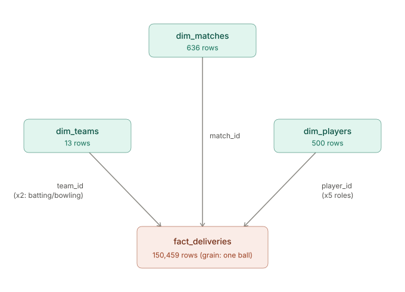

# IPL Cricket Data Pipeline — Azure Data Engineering Project

An end-to-end batch data pipeline built on Azure, transforming raw IPL (Indian Premier League) cricket data into a query-ready star schema — going from a MySQL source through Azure Data Factory, Databricks/PySpark, and Delta Lake, into a dimensional model validated against real IPL statistics.

## Architecture

```
MySQL (Azure) → ADF (Copy Activity) → ADLS raw (bronze)
              → Databricks/PySpark clean → ADLS staging (silver, Delta)
              → Databricks/PySpark reshape → ADLS curated (gold, Delta, star schema)
```



`fact_deliveries` (one row per ball bowled, 150,459 rows) sits at the center, joined to:
- `dim_matches` (636 rows) via `match_id`
- `dim_teams` (13 rows) via `team_id`, joined twice — batting team and bowling team
- `dim_players` (500 rows) via `player_id`, joined five times — batsman, bowler, non-striker, dismissed player, fielder

## Tech Stack

- **Source:** Azure Database for MySQL (Flexible Server)
- **Orchestration/Ingestion:** Azure Data Factory
- **Storage:** Azure Data Lake Storage Gen2 (hierarchical namespace, medallion layout: raw / staging / curated)
- **Transformation:** Databricks (PySpark), Delta Lake
- **Governance:** Unity Catalog (identity-based access via Storage Credentials + External Locations — no storage keys used)

## Dataset

Public IPL match data:
- `matches.csv` — 636 rows, one row per match
- `deliveries.csv` — 150,460 rows originally, one row per ball bowled

## Data Quality: Bugs Found and Fixed

Real-world data is messy. Here's what came up during cleaning, and how each was diagnosed:

| Issue | How it was found | Fix |
|---|---|---|
| Row counts exactly doubled after CSV read | Ruled out double pipeline runs, caching, duplicate files — traced to an embedded newline inside a text field splitting one row into two | Added `multiLine=True` to the CSV reader |
| `fielder` column had hidden `\r` characters | 0 nulls reported, but `.distinct()` showed corrupted values; `trim()` didn't fix it | `regexp_replace` to strip `\r` |
| Substitute fielders counted as separate people (547 vs. expected ~500 unique players) | `dim_players` row count came out higher than expected | Regex to strip the `"(sub)"` suffix before deduplicating names |
| Team name inconsistency ("Rising Pune Supergiants" vs. "Supergiant") | `dim_teams` built with 14 rows instead of an expected 13 | Standardized the name in both `deliveries` **and** `matches` (the original fix had only covered `deliveries`) |
| `umpire3` column looked populated (0 nulls) but was actually empty | Re-checked the raw CSV directly instead of trusting a prior "confirmed clean" note — found every value was just a stray `\r` artifact from CRLF line endings | `regexp_replace` to clean it, revealing the column is genuinely unpopulated |
| Databricks workspace-default storage credential blocked external storage access | `PERMISSION_DENIED` error despite correct IAM roles | Created a dedicated, unrestricted Storage Credential via the Unity Catalog Access Connector |

**Takeaway:** a "0 nulls" check isn't the same as "clean data" — always verify against the actual raw values, not just null counts.

## Engineering Decisions

**SCD (Slowly Changing Dimension) strategy:** Type 1 (overwrite) was implemented in the real pipeline via a Delta `MERGE`, since this dataset has no genuine historical team renames to track and the fact table joins on plain surrogate keys with no versioning built in. Type 2 (with `effective_start_date`, `effective_end_date`, `is_current`, and a surrogate key via `monotonically_increasing_id()`) was built and tested separately as a demonstration of the pattern, but deliberately not carried into the production tables — a scoped, explainable choice rather than an oversight.

**Serverless vs. classic compute:** The Databricks workspace defaults to serverless compute, which is faster and avoids idle-cluster costs for manual notebook work — but it blocks `spark.conf.set()`-based storage key auth as a security restriction, and isn't supported by Azure Data Factory's Notebook activity. This pipeline uses Unity Catalog identity-based auth (Access Connector → Storage Credential → External Location) instead of storage keys, which works cleanly with serverless compute for the transformation steps.

## Known Limitation: Orchestration

The ADF pipeline is wired to trigger the Databricks notebook automatically after both Copy activities succeed (linked service, Notebook activity, and success-path arrows are all correctly configured). However, triggering serverless notebooks from ADF isn't supported, and falling back to a classic job cluster hit consistent `CLOUD_PROVIDER_RESOURCE_STOCKOUT` and indefinite-pending errors across multiple VM sizes — most likely a vCPU quota ceiling on the Azure free-trial subscription, not a configuration issue. This is documented as a known infrastructure constraint; the orchestration logic itself is complete and expected to work on a non-trial subscription.

## Business Validation

Query results were checked against known real-world IPL statistics to validate pipeline correctness end-to-end:

- **Top run scorers** (`fact_deliveries` grouped by `batsman_id`, joined to `dim_players`): results matched real historical IPL leaderboards (e.g., SK Raina, V Kohli, RG Sharma near the top).
- **Team wins** (`dim_matches` grouped by `winner`): Mumbai Indians came out with the most wins (92), with 3 nulls correctly corresponding to documented no-result matches.

See `images/` for query output screenshots.

## Repository Structure

```
ipl-azure-data-pipeline/
├── README.md
├── notebooks/
│   └── IPL-notebook.py       # Exported PySpark transformation notebook
├── data/
│   ├── dim_teams.csv
│   ├── dim_players.csv
│   ├── dim_matches.csv
│   └── fact_deliveries_sample.csv   # 5,000-row sample of the full 150,459-row table
└── images/
    ├── ipl_star_schema.svg
    └── (ADF pipeline, Databricks config, and query output screenshots)
```

## Notes

This project was built hands-on to learn and demonstrate the Azure Data Engineering toolchain end-to-end, including debugging real infrastructure issues (credential restrictions, resource stockouts, CSV parsing edge cases) rather than following a pre-built tutorial. Sample data is provided since the live Azure resources are hosted on a time-limited free-trial subscription and are not guaranteed to remain accessible.
